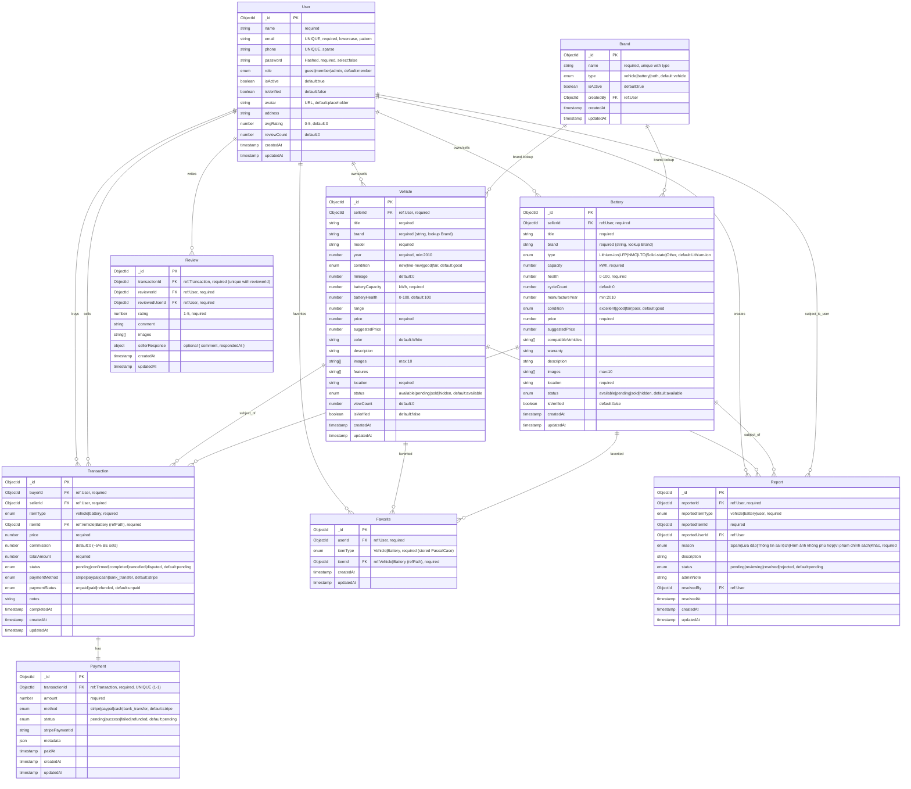

# 📊 Database Design - EV & Battery Trading Platform

## Entity Relationship Diagram (ERD)

### ERD Diagram (Mermaid)


> Notes:
> - Brand hiện là danh mục tra cứu; Vehicle/Battery lưu `brand` dạng string (không FK). Có thể nâng cấp bằng `brandId` nếu muốn ràng buộc cứng.
> - Favorite.itemType đang lưu PascalCase ('Vehicle'|'Battery') để phù hợp refPath; controller đã hỗ trợ nhận lowercase từ FE.
> - Payment–Transaction là 1–1 theo nghiệp vụ; nên enforce unique index trên `transactionId` để đúng với ERD.

### **1. User (Người dùng)**

```
- _id: ObjectId (Primary Key)
- name: String (required)
- email: String (required, unique)
- phone: String (unique)
- password: String (required, hashed)
- role: String (enum: ['guest', 'member', 'admin'], default: 'member')
- avatar: String (URL)
- address: String
- isActive: Boolean (default: true)
- isVerified: Boolean (default: false)
- avgRating: Number (0-5, default: 0)
- reviewCount: Number (default: 0)
- createdAt: Date
- updatedAt: Date
```

### Brand (Thương hiệu)

```
- _id: ObjectId (Primary Key)
- name: String (required)
- type: String (enum: ['vehicle', 'battery', 'both'], default: 'vehicle')
- isActive: Boolean (default: true)
- createdBy: ObjectId (ref: User)
- createdAt: Date
- updatedAt: Date
```

### **2. Vehicle (Xe điện)**

```
- _id: ObjectId (Primary Key)
- sellerId: ObjectId (ref: User, required)
- title: String (required)
- brand: String (required) // Hãng xe: Tesla, VinFast, BYD...
- model: String (required) // Model xe
- year: Number (required) // Năm sản xuất
- condition: String (enum: ['new', 'like-new', 'good', 'fair'], required)
- mileage: Number (km đã đi)
- price: Number (required)
- suggestedPrice: Number (AI suggest)
- batteryCapacity: Number (kWh)
- batteryHealth: Number (%) // Tình trạng pin
- range: Number (km) // Phạm vi hoạt động
- color: String
- description: String
- images: [String] // Mảng URL hình ảnh
- features: [String] // Tính năng đặc biệt
- location: String
- status: String (enum: ['available', 'sold', 'pending', 'hidden'], default: 'available')
- viewCount: Number (default: 0)
- isVerified: Boolean (default: false) // Admin đã kiểm định
- createdAt: Date
- updatedAt: Date
```

### **3. Battery (Pin riêng lẻ)**

```
- _id: ObjectId (Primary Key)
- sellerId: ObjectId (ref: User, required)
- title: String (required)
- brand: String (required)
- type: String // Loại pin: Lithium-ion, LFP...
- capacity: Number (kWh, required)
- health: Number (%, required) // Độ chai pin
- cycleCount: Number // Số chu kỳ sạc
- manufactureYear: Number
- condition: String (enum: ['excellent', 'good', 'fair', 'poor'], required)
- price: Number (required)
- suggestedPrice: Number
- compatibleVehicles: [String] // Xe tương thích
- warranty: String // Bảo hành còn lại
- description: String
- images: [String]
- location: String
- status: String (enum: ['available', 'sold', 'pending', 'hidden'], default: 'available')
- isVerified: Boolean (default: false)
- createdAt: Date
- updatedAt: Date
```

### **4. Transaction (Giao dịch)**

```
- _id: ObjectId (Primary Key)
- buyerId: ObjectId (ref: User, required)
- sellerId: ObjectId (ref: User, required)
- itemType: String (enum: ['vehicle', 'battery'], required)
- itemId: ObjectId (required) // ID của Vehicle hoặc Battery (refPath theo itemType)
- price: Number (required)
- commission: Number // Phí hoa hồng
- totalAmount: Number // Tổng tiền = price + commission
- status: String (enum: ['pending', 'confirmed', 'completed', 'cancelled', 'disputed'], default: 'pending')
- paymentMethod: String (enum: ['stripe', 'paypal', 'cash', 'bank_transfer'], default: 'stripe')
- paymentStatus: String (enum: ['unpaid', 'paid', 'refunded'], default: 'unpaid')
- notes: String
- completedAt: Date
- createdAt: Date
- updatedAt: Date
```

### **5. Review (Đánh giá)**

```
- _id: ObjectId (Primary Key)
- transactionId: ObjectId (ref: Transaction, required)
- reviewerId: ObjectId (ref: User, required) // Người đánh giá
- reviewedUserId: ObjectId (ref: User, required) // Người được đánh giá
- rating: Number (min: 1, max: 5, required)
- comment: String
- images: [String]
- sellerResponse: { comment: String, respondedAt: Date } (optional)
- createdAt: Date
- updatedAt: Date
```

### **6. Payment (Thanh toán)**

```
- _id: ObjectId (Primary Key)
- transactionId: ObjectId (ref: Transaction, required, UNIQUE) // 1-1 với Transaction
- amount: Number (required)
- method: String (enum: ['stripe', 'paypal', 'cash', 'bank_transfer'], required)
- status: String (enum: ['pending', 'success', 'failed', 'refunded'], default: 'pending')
- stripePaymentId: String // ID từ Stripe
- metadata: Object // Dữ liệu thêm từ payment gateway
- paidAt: Date
- createdAt: Date
- updatedAt: Date
```

### **7. Favorite (Danh sách yêu thích)**

```
- _id: ObjectId (Primary Key)
- userId: ObjectId (ref: User, required)
- itemType: String (enum: ['vehicle', 'battery'], required)
- itemId: ObjectId (required)
- createdAt: Date
```

### **8. Report (Báo cáo/Khiếu nại)**

```
- _id: ObjectId (Primary Key)
- reporterId: ObjectId (ref: User, required)
- reportedUserId: ObjectId (ref: User)
- reportedItemType: String (enum: ['vehicle', 'battery', 'user'])
- reportedItemId: ObjectId
- reason: String (required)
- description: String
- status: String (enum: ['pending', 'reviewing', 'resolved', 'rejected'], default: 'pending')
- adminNote: String
- resolvedBy: ObjectId (ref: User)
- resolvedAt: Date
- createdAt: Date
- updatedAt: Date
```

---

## 📌 Mối quan hệ (Relationships)

1. **User - Vehicle**: 1-N (Một user có thể bán nhiều xe)
2. **User - Battery**: 1-N (Một user có thể bán nhiều pin)
3. **User - Transaction**: 1-N (Buyer & Seller)
4. **Transaction - Review**: 1-N (Một giao dịch có thể có nhiều review)
5. **Transaction - Payment**: 1-1 (Một giao dịch có một thanh toán)
6. **User - Favorite**: 1-N (Một user có nhiều favorite)
7. **User - Report**: 1-N (Một user có thể tạo nhiều report)
8. **Brand - Vehicle**: 1-N (Quan hệ danh mục theo tên; hiện Vehicle.brand là string lookup)
9. **Brand - Battery**: 1-N (Quan hệ danh mục theo tên; hiện Battery.brand là string lookup)

---

## 🎯 Indexes (Để tối ưu tìm kiếm)

### Vehicle Collection

- `{ sellerId: 1 }`
- `{ brand: 1, year: -1 }`
- `{ price: 1 }`
- `{ status: 1, createdAt: -1 }`
- `{ brand: 'text', model: 'text', title: 'text' }` (Text search)

### Battery Collection

- `{ sellerId: 1 }`
- `{ brand: 1, capacity: -1 }`
- `{ price: 1 }`
- `{ status: 1, createdAt: -1 }`

### Transaction Collection

- `{ buyerId: 1, createdAt: -1 }`
- `{ sellerId: 1, createdAt: -1 }`
- `{ status: 1 }`

### Brand Collection

- `{ name: 1, type: 1 }` (unique)
- `{ isActive: 1 }`

### User Collection

- `{ email: 1 }` (unique)
- `{ phone: 1 }` (unique)
- `{ role: 1 }`
